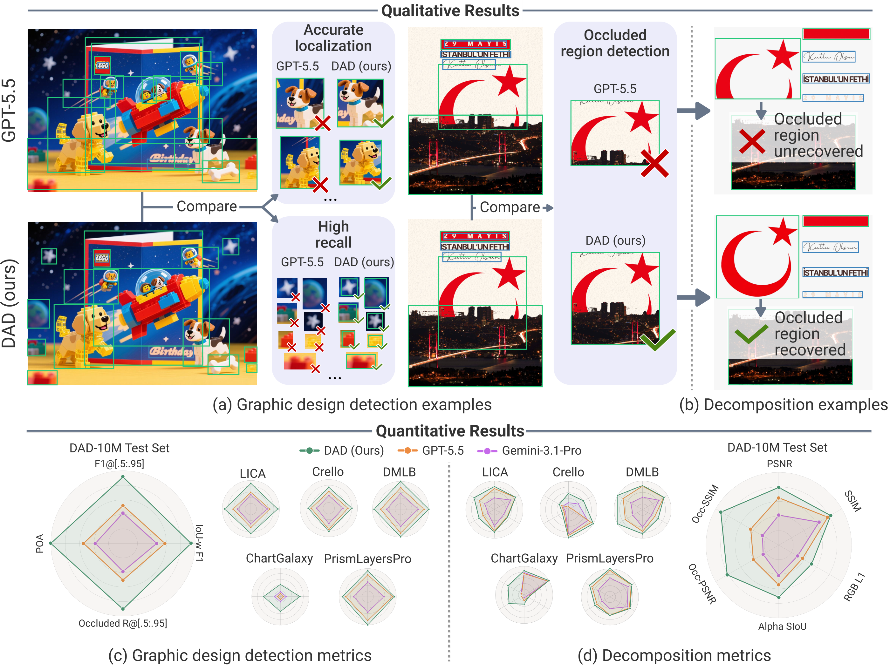

# Detect Anything in Graphic Design: Element-Level Rewards for Autoregressive Detection

**NeurIPS 2026**



*DAD improves element localization and recall, recovers occluded regions, and supports image-to-layer decomposition. Qualitative examples and benchmark results are from the paper; radar-chart metrics are normalized to [0.1, 1].*

## Abstract

Graphic designs, such as posters, advertisements, and infographics, are an important medium for communicating information and shaping understanding. Unlike natural images, they consist of layered elements with explicit compositional order. However, existing object detection models treat these elements as an unordered set, leaving compositional order unexploited. To address this limitation, we present Detect Anything in Graphic Design (DAD), a model that formulates graphic design detection as compositional deconstruction. It decodes elements in compositional order, using lower-layer elements to better detect higher-layer ones. The key feature of DAD is amodal detection, which predicts the full bounding box of each element, including regions occluded by elements placed above it. Building on this formulation, we propose Element Relative Policy Optimization (EleRPO), which extends GRPO from sequence-level supervision to element-level optimization. EleRPO provides fine-grained training signals that capture how each detected element contributes to overall detection quality, and works synergistically with compositional order to improve detection performance. To support training and evaluation, we build a dataset of 10 million graphic designs. Experiments show that DAD outperforms all baselines and achieves human-level performance in amodal detection, supporting effective image-to-layer decomposition. EleRPO consistently improves over GRPO across nine detection benchmarks.

## Method and data

- **DAD** predicts design elements in back-to-front compositional order, with amodal bounding boxes covering their full extent, including occluded regions.
- **EleRPO** assigns element-level rewards by decomposing sequence-level detection rewards, without additional reward models or extra sampling passes.
- **DAD-10M** supports training and evaluation with 10 million graphic designs. The [public dataset release](https://huggingface.co/datasets/dad887/DAD) provides approximately one million element-replaced designs and 100,000 ChartGalaxy designs, with layer assets and detection annotations.

## Repository contents

| Directory | Contents |
|---|---|
| [elerpo](elerpo/README.md) | Element-level reward and advantage implementation, with integration examples |
| [data/annotation](data/annotation/README.md) | Appendix B prompt and model-calling script |
| [data/filtering](data/filtering/README.md) | Small-element selection and over-splitting filter |
| [data/element_replacement](data/element_replacement/README.md) | Reference-driven layered design synthesis, with image, layer, and annotation export |
| [inference](inference/README.md) | Model loading, prediction, data download, and evaluation |

## Dataset

The [DAD dataset repository](https://huggingface.co/datasets/dad887/DAD) contains composited images, individual layer assets, and aligned annotations for graphic-design detection and image-to-layer decomposition. Its dataset card describes the subsets, file layout, annotation schema, and loading instructions.

The [layered design synthesis pipeline](data/element_replacement/README.md) generates new backgrounds and foreground elements from reference designs, composes them into layered images, and exports amodal boxes, visible boxes, and individual layers. Its installation and usage instructions are provided in the pipeline directory.

## Public-data experiment

The paper also includes an experiment using public data. Its [SFT, RL, and test splits](https://huggingface.co/datasets/dad887/DAD-Public-Repro) and [SFT, GRPO, and EleRPO models](https://huggingface.co/dad887/DAD-Public-Models) are available on Hugging Face. These released models are based on Qwen3-VL-2B-Instruct and are separate from the DAD model used for the paper's main experiments.

### Install

Use Python 3.10 or newer and a PyTorch installation suitable for your device.

```bash
pip install -r requirements.txt
```

### Detect and evaluate

Run from this repository's root. The command downloads the selected model and the test split, verifies image checksums, and writes one prediction per image.

```bash
python -m inference.predict --variant elerpo --output outputs/elerpo.jsonl
python -m inference.evaluate \
  --annotations public_data/annotations/test.jsonl \
  --predictions outputs/elerpo.jsonl
```

Choose `--variant sft`, `grpo`, or `elerpo`. For a quick check, add `--limit 8`; the full test split contains 5,000 examples. See [inference instructions](inference/README.md) for local files, single-image detection, decoding, and optional accelerated inference.

Training settings are described in the paper. This release provides model weights and standalone inference/evaluation tools; it does not include training launchers.

### Output

Models generate layers in back-to-front order:

```text
x1,y1,x2,y2,t;x1,y1,x2,y2,v;
```

Coordinates use the normalized range `[0, 1000]`. `t` denotes text and `v` denotes a visual element. Dataset annotations use pixel-space `xyxy` boxes, with the image dimensions stored in each record.

## License

Code: [Apache 2.0](LICENSE). Model weights and datasets have their own license files and upstream notices in the corresponding Hugging Face repositories.
